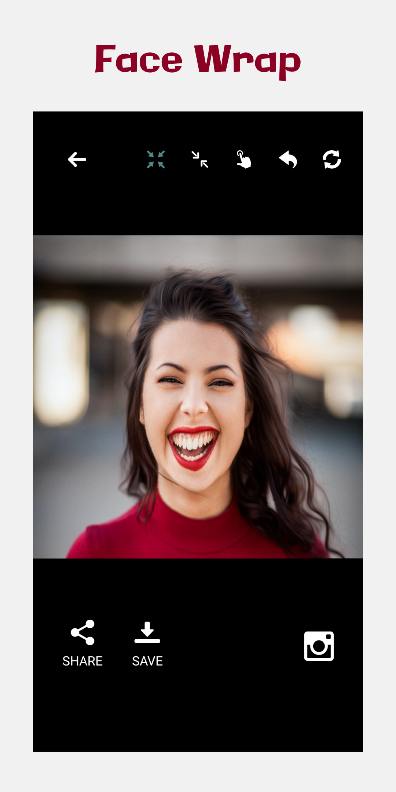
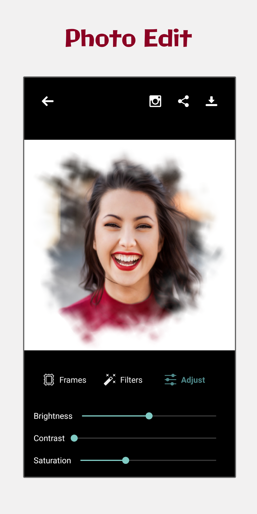
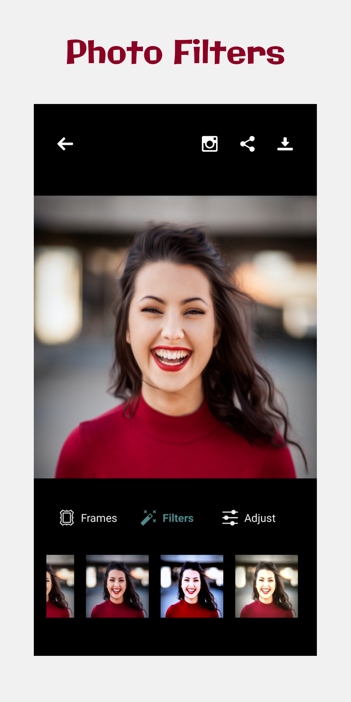
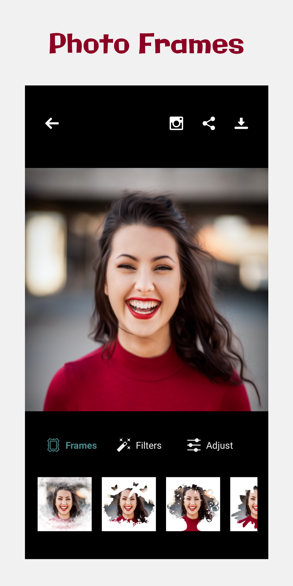
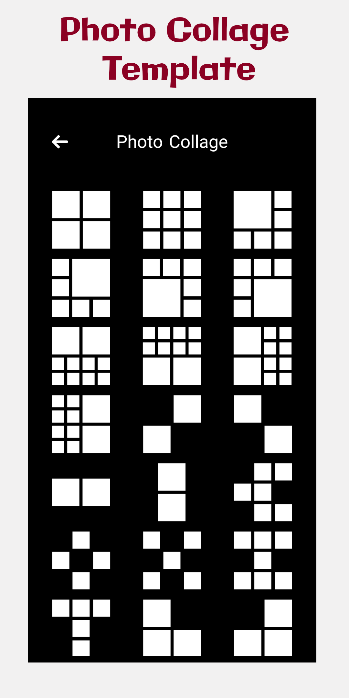

# Photo-Editing

   

Photo Editor Pro offers everything you want to edit pictures.

1- Photo Collage Maker.  
2- Photo Lab editor.  
3- Photo Wrap editor.

Articles  
https://www.androidhive.info/2017/11/android-building-image-filters-like-instagram/
